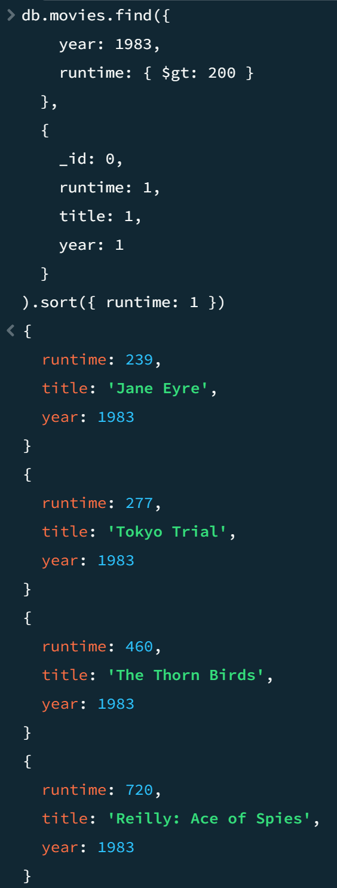
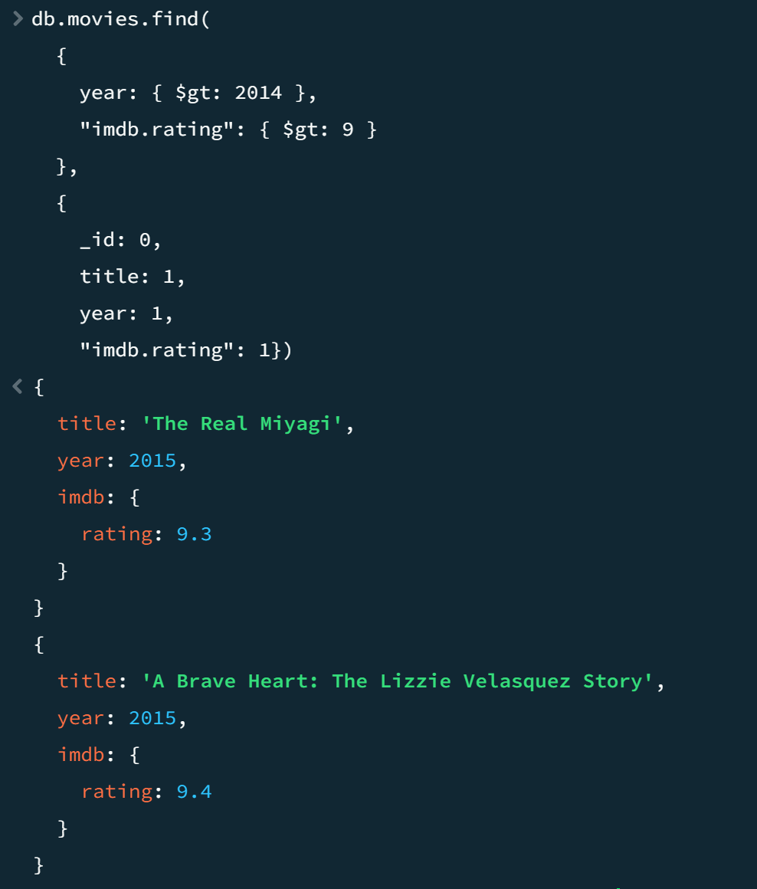

# Assignment-3-MongoDB-Setup-and-Queries
## Query 1: Movies in 1983 with Runtime > 200 Minutes

**Goal:**  
Find all movies released in the year 1983 with a runtime greater than 200 minutes. Return only the `runtime`, `title`, and `year` fields.

**MongoDB Query and result:**

## Query 2: Movies After 2014 with IMDb Rating > 9

**Goal:**  
Find all movies released after the year 2014 with an IMDb rating greater than 9. Only the `title`, `year`, and `imdb.rating` fields should be included.

**MongoDB Query and result:**

